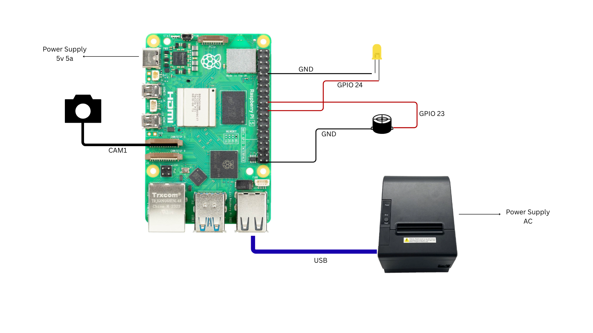
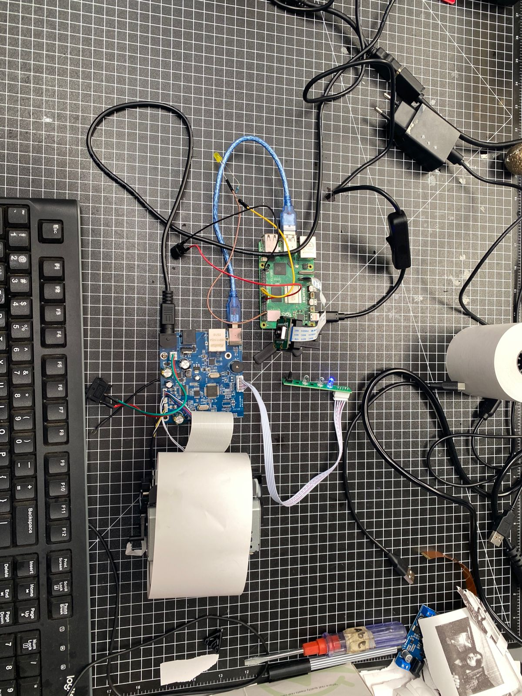

# Potboy - Photo Booth with Live Preview

A photo booth system with live video preview on a web UI. Click to capture photos from a Raspberry Pi camera (Arducam), and print receipts on a thermal printer.

## Architecture (v2 - Web UI)

```
💻 Laptop (Server)                           🍓 Raspberry Pi (Client)
┌─────────────────────────────────────┐     ┌─────────────────────────────┐
│       main_server2.py               │     │    008_main_client.py       │
│                                     │     │                             │
│  🌐 Web UI (https://IP:5000)        │     │  📷 Camera (Arducam 64MP)   │
│  ┌─────────────────────────────┐    │     │  🎥 MJPEG streaming         │
│  │  [Start Preview]  [Capture] │    │     │  💡 LED + 🔊 Buzzer         │
│  │  ┌───────────────────────┐  │    │     │  🖨️ Thermal printer         │
│  │  │    Live Video Feed    │  │    │     │                             │
│  │  │      from Pi          │  │    │     │  HTTP endpoints:            │
│  │  └───────────────────────┘  │    │     │  - /preview/start           │
│  └─────────────────────────────┘    │     │  - /preview/stop            │
│                                     │     │  - /stream (MJPEG)          │
│  HTTP ──────────────────────────────┼────▶│  - /capture                 │
│       (trigger preview/capture)     │     │                             │
│                                     │     └──────────────┬──────────────┘
│  WebSocket (wss://IP:8765) ◀────────┼────────────────────┘
│       (receive image, send receipt) │       (captured photo)
│                                     │
└─────────────────────────────────────┘
```

## Quick Start

### 1. Server (Windows/Mac/Linux)

**Configure `.env`:**
```bash
cd Server
cp .env.example .env
```

Edit `Server/.env`:
```env
WEBSOCKET_PORT=8765
QR_SERVER_PORT=5000
RASPBERRY_PI_IP=192.168.0.xxx    # ⬅️ Your Pi's IP address
RASPBERRY_PI_PORT=5001
```

**Run:**
```bash
cd Server
pip install -r requirements.txt
python main_server2.py
```

Open `https://YOUR_PC_IP:5000` in your browser.

---

### 2. Raspberry Pi (Client)

**Configure `.env`:**
```bash
cd ~/thermalPrinterRaspy
cp .env.example .env
nano .env
```

Edit `.env`:
```env
# WebSocket server (use wss:// for SSL)
WS_SERVER=wss://192.168.0.xxx:8765    # ⬅️ Your server's IP address

# Camera settings
RPICAM_INDEX=0                         # Camera port (0 or 1)

# GPIO pins
LED_PIN=24
BUZZER_PIN=23
```

**Run manually (for testing):**
```bash
source venv/bin/activate
python 008_main_client.py
```

**Run as service (auto-start on boot):**

First, copy the service file from your PC to the Pi:
```bash
# From your PC (Windows PowerShell or Mac/Linux terminal)
scp Client/camera-server.service pi@PI_IP:/tmp/

# Or with full path on Windows:
scp c:\sapi\CLW\potboy\Client\camera-server.service pi@PI_IP:/tmp/
```

Then on the Pi:
```bash
# Move service file to systemd
sudo mv /tmp/camera-server.service /etc/systemd/system/

# Edit if needed (verify paths)
sudo nano /etc/systemd/system/camera-server.service

# Enable and start
sudo systemctl daemon-reload
sudo systemctl enable camera-server.service
sudo systemctl start camera-server.service
```

---

## Usage

1. **Start server** on your PC: `python main_server2.py`
2. **Start client** on Pi (or ensure service is running)
3. Open `https://YOUR_SERVER_IP:5000` in browser
4. Click **Start Preview** to see live video
5. Click **Capture** to take photo
   - 5-second countdown with LED/buzzer
   - Photo captured and sent to server
   - Receipt printed on thermal printer

---

## Configuration Reference

### Server `.env`

| Variable | Default | Description |
|----------|---------|-------------|
| `WEBSOCKET_PORT` | 8765 | WebSocket port (wss://) |
| `QR_SERVER_PORT` | 5000 | HTTPS web UI port |
| `RASPBERRY_PI_IP` | - | Pi's IP address |
| `RASPBERRY_PI_PORT` | 5001 | Pi's HTTP port |

### Client `.env`

| Variable | Default | Description |
|----------|---------|-------------|
| `WS_SERVER` | - | Server WebSocket URL (wss://IP:8765) |
| `HTTP_PORT` | 5001 | HTTP server port |
| `RPICAM_INDEX` | 0 | Camera index (0=CAM0, 1=CAM1) |
| `LED_PIN` | 24 | GPIO pin for LED |
| `BUZZER_PIN` | 23 | GPIO pin for buzzer |
| `PRINTER_DEVICE` | /dev/usb/lp0 | Thermal printer path |

---

## Common Commands

### Raspberry Pi Service

```bash
# Start/stop/restart
sudo systemctl start camera-server.service
sudo systemctl stop camera-server.service
sudo systemctl restart camera-server.service

# View logs
sudo journalctl -u camera-server.service -f

# After changing .env, just restart:
sudo systemctl restart camera-server.service
```

### Changing IP Addresses

**Server IP changed?** Edit Pi's `.env`:
```bash
nano ~/thermalPrinterRaspy/.env
# Change: WS_SERVER=wss://NEW_SERVER_IP:8765
sudo systemctl restart camera-server.service
```

**Pi IP changed?** Edit Server's `.env`:
```bash
# Edit Server/.env
# Change: RASPBERRY_PI_IP=NEW_PI_IP
# Restart server
```

---

## Troubleshooting

### Camera "not available" error
```bash
# Kill stuck camera processes
sudo pkill -9 rpicam
sudo systemctl restart camera-server.service
```

### Preview not showing
1. Check Pi logs: `sudo journalctl -u camera-server.service -f`
2. Test stream directly: `curl -s http://PI_IP:5001/stream --max-time 3 | wc -c`
3. Should return bytes > 0

### WebSocket SSL error
Make sure Pi's `.env` uses `wss://` (not `ws://`):
```env
WS_SERVER=wss://192.168.0.xxx:8765
```

### GPIO busy
```bash
sudo systemctl stop camera-server.service
sudo pkill -9 rpicam
sudo systemctl start camera-server.service
```

### Printer not working
```bash
ls /dev/usb/lp*          # Check printer detected
echo "Test" > /dev/usb/lp0   # Test print
```

### Test camera manually
```bash
rpicam-hello --list-cameras  # List cameras
rpicam-still -o test.jpg     # Test capture
```

---

## Hardware

### Tested Configuration
- **Raspberry Pi 5**
- **Arducam 64MP Camera** (works with libcamera/rpicam-still)
- **58mm USB Thermal Printer** (ESC/POS compatible)
- **LED** (optional, for visual feedback)
- **Active Buzzer** (optional, for audio countdown)

### Wiring Photos

**Wiring Diagram:**



**Implementation:**



### Installation & Mounting


**Bolt/Screw Requirements:**

| Component | Bolt Size | Quantity |
|-----------|-----------|----------|
| **Camera (Arducam)** | M3×40mm | 1 |
| | M2.5×10mm | 4 |
| | M3×12mm | 2 |
| **PSU (Power Supply)** | M3×12mm | 2 |
| **Raspberry Pi 5** | M2.5×30mm | 4 |
| **Printer (POS-80)** | M3×12mm | 4 |
| | M3×25mm | 5 |

### Wiring Diagram (Text)

```
                    Raspberry Pi 5 GPIO
                    ┌─────────────────────────────────────┐
                    │  (pin 1)  3.3V    5V   (pin 2)     │
                    │  (pin 3)  GPIO2   5V   (pin 4)     │
                    │  (pin 5)  GPIO3   GND  (pin 6)     │
                    │  (pin 7)  GPIO4   GPIO14 (pin 8)   │
                    │  (pin 9)  GND     GPIO15 (pin 10)  │
                    │  (pin 11) GPIO17  GPIO18 (pin 12)  │
                    │  (pin 13) GPIO27  GND    (pin 14)  │
                    │  (pin 15) GPIO22  GPIO23 (pin 16)  │◄── BUZZER
                    │  (pin 17) 3.3V    GPIO24 (pin 18)  │◄── LED
                    │  (pin 19) GPIO10  GND    (pin 20)  │
                    │  (pin 21) GPIO9   GPIO25 (pin 22)  │
                    │  (pin 23) GPIO11  GPIO8  (pin 24)  │
                    │  (pin 25) GND     GPIO7  (pin 26)  │
                    │  ... (more pins below)             │
                    └─────────────────────────────────────┘
```

### LED Wiring (GPIO 24)

```
GPIO 24 (pin 18) ──────┬──────[ 330Ω ]────────┐
                       │                       │
                       │                      ▼ LED (+)
                       │                       │
GND (pin 20) ──────────┴───────────────────────┘ LED (-)
```

- **GPIO 24** → 330Ω resistor → LED anode (+, longer leg)
- **LED cathode** (-, shorter leg) → GND

### Active Buzzer Wiring (GPIO 23)

```
GPIO 23 (pin 16) ──────────────────┐
                                   │
                                  ▼ BUZZER (+)
                                   │
GND (pin 14 or 20) ────────────────┘ BUZZER (-)
```

- **GPIO 23** → Buzzer positive (+)
- **Buzzer negative** (-) → GND
- Use an **active buzzer** (makes sound when voltage applied)

### Camera Connection (Arducam)

```
┌─────────────────────────────────────────────────┐
│              Raspberry Pi 5                      │
│                                                  │
│    ┌────────┐              ┌────────┐           │
│    │  CAM0  │              │  CAM1  │ ◄── Use   │
│    └────────┘              └────────┘     this  │
│                                                  │
└─────────────────────────────────────────────────┘
         │                        │
         ▼                        ▼
    (may not work           Arducam 64MP
     on some units)         ribbon cable
```

- Connect Arducam ribbon cable to **CAM1** port
- Blue side of ribbon faces the USB ports
- If CAM1 doesn't work, try CAM0 and change `RPICAM_INDEX = 0`

### Thermal Printer Connection

```
┌─────────────────┐         ┌─────────────────┐
│  Raspberry Pi   │   USB   │ Thermal Printer │
│                 │ ══════► │   (58mm/80mm)   │
│                 │         │   ESC/POS       │
└─────────────────┘         └─────────────────┘
                                    │
                                    ▼
                             Power adapter
                              (usually 9V/12V)
```

- Connect via USB cable
- Printer appears as `/dev/usb/lp0`
- Requires separate power supply (not USB powered)

### Complete Wiring Summary

| Component | Connection | GPIO/Port |
|-----------|------------|-----------|
| Arducam 64MP | CAM1 ribbon connector | CAM1 |
| LED | GPIO 24 + 330Ω resistor | Pin 18 |
| Active Buzzer | GPIO 23 | Pin 16 |
| Thermal Printer | USB port | /dev/usb/lp0 |

### GPIO Pin Configuration

To change GPIO pins, edit `.env` on the Raspberry Pi:

```env
LED_PIN=24       # Physical pin 18
BUZZER_PIN=23    # Physical pin 16
```
